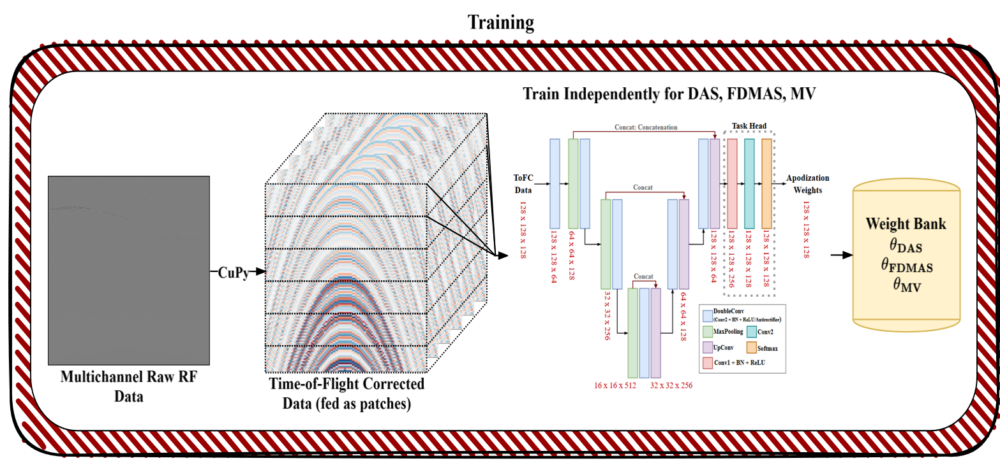
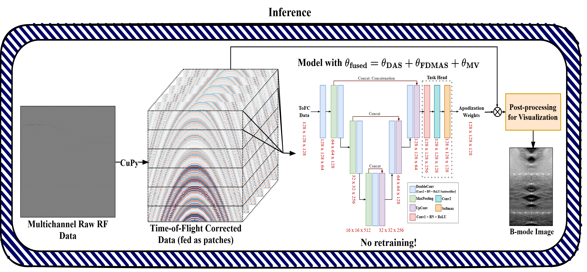

# ADAPT: Adaptive Depth-Agnostic Patch-wise Tunable Multibeamformer

[](https://www.python.org/downloads/)
[](https://pytorch.org/)
[](https://developer.nvidia.com/cuda-zone)
[]([link_to_proceedings](https://doi.org/10.1109/ISBI61048.2026.11515322))

**ADAPT** is a deep learning framework for adaptive ultrasound beamforming that achieves depth-independent learning through patch-wise processing. By utilizing **parameter-space fusion**, ADAPT enables the dynamic blending of DAS, FDMAS, and MV beamformers without retraining, providing clinicians with tunable, task-specific diagnostic perspectives in a single forward pass.

[**📄 Read the Full Paper**](link yet to be released!)

---

## Key Features
* **Depth-Agnostic Processing:** Axial patching (128 samples/patch) ensures generalization across varying imaging depths.
* **AntiRectifier Architecture:** Preserves gradient flow for both polarities of raw RF data by concatenating $ReLU(x)$ and $ReLU(-x)$.
* **Tunable Weight Fusion:** Post-training parameter averaging allows for dynamic blending:
    $$\theta_{fused} = \alpha \cdot \theta_{DAS} + \beta \cdot \theta_{FDMAS} + \gamma \cdot \theta_{MV}$$
* **GPU Acceleration:** Vectorized bilinear interpolation and ToFC powered by **CuPy**.

---

## Methodology & Architecture

### Training Pipeline
The framework trains three identical U-Nets independently for DAS, FDMAS, and MV tasks. The patch-wise strategy allows the model to learn local wavefront characteristics regardless of the absolute depth.


*Figure 1: Overview of the ADAPT training workflow and patch-wise data augmentation.*

### Inference & Fusion
Instead of output ensembling, ADAPT performs fusion in the weight space. This significantly reduces computational overhead during inference while allowing real-time tuning of image characteristics.

Post-training weighted parameter averaging allows for task-specific optimization without retraining:
$$\theta_{fused} = \alpha \cdot \theta_{DAS} + \beta \cdot \theta_{FDMAS} + \gamma \cdot \theta_{MV}$$


*Figure 2: The weight fusion mechanism enabling tunable diagnostic perspectives.*

---

## 🛠️ Installation & Setup

### Prerequisites
- Python 3.8 or higher
- CUDA (NVIDIA GPU Required)
- [PyTorch](https://pytorch.org/get-started/locally/) installed for your specific hardware

### Setup
1.  **Clone the Repository**
    ```bash
    git clone [https://github.com/gopikagopikrishnan/ADAPT.git](https://github.com/gopikagopikrishnan/ADAPT.git)
    cd ADAPT
    ```

2.  **Install Dependencies**
    ```bash
    pip install -r requirements.txt
    ```

---

## 💻 Usage

To perform adaptive beamforming and weight fusion:

1.  **Prepare Data:** Input raw RF channel data in HDF5 format
2.  **Train Individual Apodization Networks:**
3.  **Run Inference:**
    ```bash
    python inference.py --alpha 0.2 --beta 0.4 --gamma 0.4
    ```
    Adjust $\alpha, \beta, \gamma$ dynamically to blend DAS, FDMAS, and MV characteristics respectively.
    
---

## 📜 Academic Citation
If you use this code or data in your research, please cite the work.

## Repository Structure
```text
ADAPT/
├── configs/          # Hyperparameters (fs, fc, c, patch size)
├── preprocess/       # RF to HDF5 conversion scripts
├── tofc_functions/   # Different tofc functions that were used to improve computational speed
├── data/             # Dataset loaders (ToFC + patching)
├── model/            # FixedUNetBeamformer & AntiRectifier
├── train/            # Task-specific training loops
├── inference/        # Parameter-space weight fusion logic
└── requirements.txt
